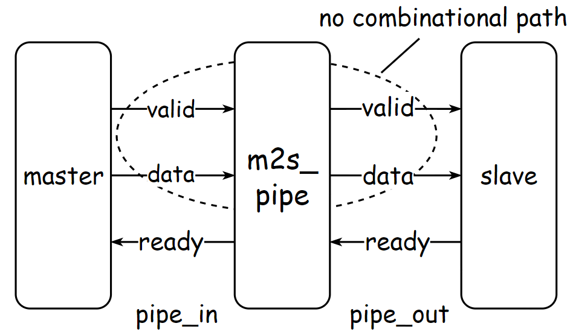

# Introduction
The goal of m2s_pipe module is to pipeline valid-ready based bus with valid and payload signals registered. The valid-ready signal pair is widely adopted to control interactions between different components in digital system designs. Taking standard [AXI](https://zipcpu.com/blog/2021/08/28/axi-rules.html) bus for example, all channels use valid-ready handshake process to transfer data, address and control information. For generic valid-ready based transaction, there are three signals, including **valid**, **ready** and **data**, connecting between two interacting parties, including **master** and **slave**. The **master** drives **data** signal that carries information to be transfered and pull up **valid** signal to initiate a transaction. The **slave** pulls up **ready** signal to indicate that it's ready to receive **data** signal. A transaction between **master** and **slave** only completes successfully when both **valid** and **ready** signals are high. The **master** needs to keep **valid** and **data** signals until a transaction completes, that is **ready** signal being pulled up.

In digital system design, it' common to pipeline signals transmission between two modules to improve the working frequency. For pipelining valid-ready based bus, it's not just about inserting registers between two signal ports. To ensure the correctness of pipelined bus, we also needs to carefully design the logic of control signals for these registers. There are signals in both directions for valid-ready based bus and in this practice we only focus on how to pipeline signals driven from **master** to **slave**

# Specification
The interface definition of m2s_pipe module to be implemented in this practice is as follows:

| name | direction | width | description |
| :----: | :----:  | :----:  | :----:      |
| pipe_in_valid | in | 1-bit | **valid** signal driven from **master**|
| pipe_in_ready | out| 1-bit | **ready** signal driven to **master**  |
| pipe_in_data  | in | 1-bit | **data** signal driven from **master** |
| pipe_out_valid | out | 1-bit | **valid** signal driven to **slave**|
| pipe_out_ready | in | 1-bit | **ready** signal driven from **slave**|
| pipe_out_data  | out | 1-bit | **data** signal driven to **slave** |

The module m2s_pipe which is designed to pipeline signals transmitted from **master** to **slave** should ensure that there are no combinational paths from **pipe_in_valid** port to **pipe_out_valid** port, and from **pipe_in_data** port to **pipe_out_data** port.

# Links
- Introduction of valid-ready hankshake: https://zipcpu.com/blog/2021/08/28/axi-rules.html
