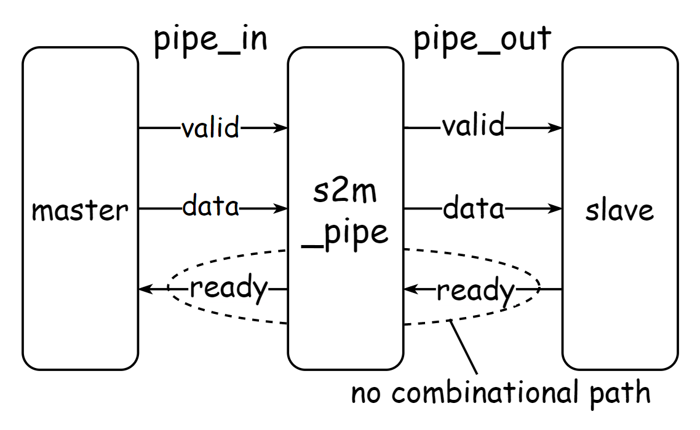

# Introduction
The goal of m2s_pipe module is to pipeline valid-ready based bus with **ready** signal registered. The detailed description of valid-ready handshake process has been provided in practice [m2s_pipe](../m2s_pipe/). Or you can also refer to this [link](https://zipcpu.com/blog/2021/08/28/axi-rules.html) which describes the hankshaking rules for AXI protocol. It's much more complicated to pipeline **ready** signal compared to pipelining **valid** and **data** signals and you can refer to this [article](https://www.itdev.co.uk/blog/pipelining-axi-buses-registered-ready-signals) for some hints if you get stuck.

# Specification

The interface definition of s2m_pipe module to be implemented in this practice is as follows:

| name | direction | width | description |
| :----: | :----:  | :----:  | :----:      |
| pipe_in_valid | in | 1-bit | **valid** signal driven from **master**|
| pipe_in_ready | out| 1-bit | **ready** signal driven to **master**  |
| pipe_in_data  | in | 1-bit | **data** signal driven from **master** |
| pipe_out_valid | out | 1-bit | **valid** signal driven to **slave**|
| pipe_out_ready | in | 1-bit | **ready** signal driven from **slave**|
| pipe_out_data  | out | 1-bit | **data** signal driven to **slave** |

The module s2m_pipe which is designed to pipeline signal transmitted from **slave** to **master** should ensure that there are no combinational paths from **pipe_out_ready** port to **pipe_in_ready**.

